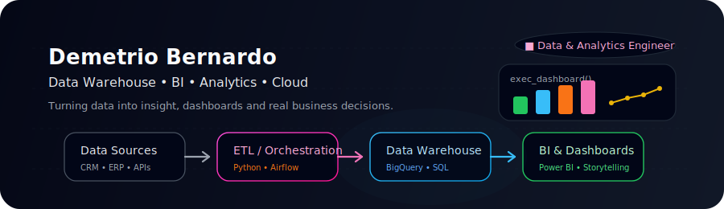

  
   
  

## I'm Demetrio Bernardo 👋

- 📊 Data Scientist & BI Developer focused on data-driven decision making  
- 🧠 Working with Data Warehousing, ETL/ELT, dashboards and analytics products  
- ⚙️ Experience with SQL Server, PostgreSQL, Oracle, Google BigQuery, SSIS, Pentaho and Apache Airflow  
- 💻 Building backend systems with Python (Django), REST APIs, MongoDB, HTML and CSS  
- 📌 Passionate about building scalable data solutions that actually move business metrics forward  
- 🌎 Languages: Portuguese (native), English & Spanish (professional working proficiency)

> “Data is only useful when it becomes action.”  
> I love transforming messy databases into clear stories for business.

---

### 🔗 Connect with me

---

### 🛠️ Tech Stack &amp; Tools

 

  <!-- Databases & SQL -->
  
  
  
  
  

  <!-- Programming & Data -->
  
  
  
  
  

  <!-- Web / Frontend -->
  
  

  <!-- Orchestration &amp; Big Data -->
  

  <!-- Cloud &amp; DevOps -->
  
  
  

  <!-- Version Control -->
  

 

> Also working daily with:
> - 📊 Microsoft Power BI (data modeling, DAX, dashboards &amp; data storytelling)  
> - 🔁 ETL/ELT with SSIS, Pentaho and custom Python pipelines  
> - 🧱 Data modeling for Data Warehouses and analytics environments  

---

### 🚀 What I’m into right now

- Building analytics products that can be reused across multiple clients  
- Modeling Data Warehouses and creating robust data pipelines (SQL + Python + Airflow)  
- Designing dashboards that executives *actually* use in their day-to-day  
- Improving my skills in distributed data processing and cloud architectures  

---

<picture>
  <source media="(prefers-color-scheme: dark)" srcset="https://raw.githubusercontent.com/Demetriobc/Demetriobc/output/github-contribution-grid-snake-dark.svg">
  <source media="(prefers-color-scheme: light)" srcset="https://raw.githubusercontent.com/Demetriobc/Demetriobc/output/github-contribution-grid-snake.svg">
  
</picture>

  
